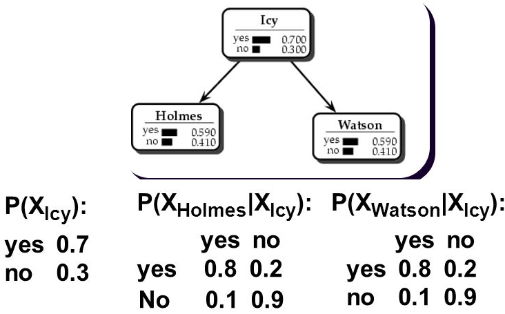
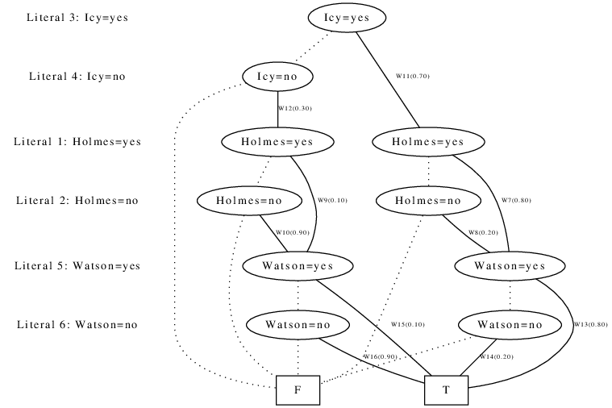
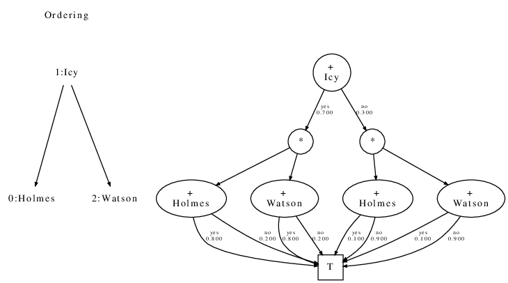
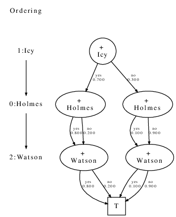

# ParaGnosis Tool Demo

ParaGnosis is a C++ weighted model counting toolset for Linux. Its implementation is based on [[1,2,3,4]](#4). We have also added a significant number of Bayesian networks to play with (under *./data/net*). This demo will first introduce the user to the toolset and the input formats. Then we will demonstrate three ways to use the tool:

* Compile a Bayesian network to a knowledge base in different target languages.
* Compare the results of the compilation process for different target languages.
* Visualize the compilation result using dot
* Perform various inference queries on the compiled knowledge base:
  * marginalization,
  * conditional probabilities, and
  * posteriors.
* Compare marginalization results on different target languages.

The tool consists of the following command-line tools:

* `bn-to-cnf`: a c++ tool to create Conjunctive Normal Form (CNF) encodings from a Bayesian network.
* `bnc`: a c/c++ **B**ayesian **N**etwork **C**ompiler for multiple target representations.
* `bnmc`: a  c++ **B**ayesian **N**etwork **M**odel **C**ounter.
* `pg`: a **P**ara**G**nosis user friendly interface to the tools above, written in Python.

The currently supported target languages are:

* Weighted Positive Binary Decision Diagrams (WPBDD)
* Weighted Positive Multi-Valued Decision Diagrams (WPMDD)
* Tree-driven Weighted Positive Multi-valued Decision Diagrams (TD-WPMDD)

## The demo

The `pg` script is installed system wide, and directly available from the command-line by opening a terminal. A shortcut to open a terminal is `ctrl-alt-t`.

### Encoding

#### Show a list of available Bayesian networks

The toolset comes with a comprehensive list of Bayesian networks to play with. To get a list of available networks, type:

    > pg --list

        3nt
        4sp
        6hj
        6nt
        aggregate
        alarm
        ...

Any of the shown names can be used as input for the `pg` script. You can also provide a locally stored Bayesian network filename with `.net` extension (HUGIN format).

#### Show encoding statistics for the *asia* network

    > pg encode asia

        ...

        Variables       : 8
        Probabilities   : 36
        Deterministic   : 8
        Unsatisfiable   : 4
        Literals        : 16
        Clauses         : 52
        Literal/clauses : 2.23
        Clause sizes    : 1-3

### Compiling a network

#### Compile *asia* to a TD-WPMDD

    > pg compile asia

        ...

        FINAL RESULT:

            Spanning tree     : 0.011ms
            Compilation       : 0.015ms
            Total Or #nodes   : 23
            Total And #nodes  : 6
            Total time        : 0.000s
            Total time        : 0.026ms

            Total #nodes      : 29
            Total #edges      : 58
            Total #operators  : 144

#### Compile *asia* to a WPBDD

    > pg compile asia --method wpbdd

        ...

        FINAL RESULT:

            Compiled CPTs in  : 0.000s
            Conjoined CPTs in : 0.000s
            Total time        : 0.000s
            Total time        : 0.244ms

            Total #nodes      : 45
            Total #edges      : 90
            Total #operators  : 124

#### Compare compilation between WPBDD, a WPMDD, and a TD-WPMDD

    > pg compile asia --method wpbdd mg tdmg

        ...

         nr  | type   |  seconds | milliseconds |   speed-down |    operators |   nodes |   edges
         ----|--------|----------|--------------|--------------|--------------|---------|---------
           0 | TDMG   |    0.000 |        0.031 |        1.000 |          144 |      29 |     58
           1 | MG     |    0.000 |        0.089 |        2.871 |          132 |      22 |     44
           2 | WPBDD  |    0.000 |        0.155 |        5.000 |          124 |      45 |     90

#### The following is the *icy roads* Bayesian network that we want to compile

#### Directly visualize the WPBDD for the *icy_roads* network

    > pg compile icy_roads --method wpbdd --dot

#### Directly visualize the TD-WPMDD

    > pg compile icy_roads --method tdmg --dot

#### Directly visualize the TD-WPMDD

    > pg compile icy_roads --method mg --dot

### Perform Inference

#### Verify *icy roads* posteriors, previously shown

    > pg inference --posteriors="" icy_roads

    ...

    Holmes=yes: 0.590000
    Holmes=no: 0.410000
    Icy=yes: 0.700000
    Icy=no: 0.300000
    Watson=yes: 0.590000
    Watson=no: 0.410000

#### Run every possible marginalization on a network using TD-WPMDD (press ctrl-c to stop)

    > pg inference asia

        ...

         nr |         type |  cores |      queries | milliseconds |         ms/q
        ----|--------------|--------|--------------|--------------|--------------
          0 | TDMULTIGRAPH |      1 |        18360 |       8.7516 |       0.0005

#### Compare WPBDD inference speed with TD-WPBDD

    > pg inference asia --method wpbdd tdmg --compare

        ...

         nr |         type |  cores |      queries | milliseconds |         ms/q |   speed-down
        ----|--------------|--------|--------------|--------------|--------------|--------------
          0 | WPBDD        |      1 |        18360 |       5.7327 |       0.0003 |         1.00
          1 | TDMULTIGRAPH |      1 |        18360 |      10.5697 |       0.0006 |         1.84

#### Compute conditional probability P(tub | bronc = yes, smoke = yes) for the *asia* netwrok

    > pg inference asia --evidence='bronc=yes,smoke=yes' --posteriors='tub'

        ...

        tub=yes: 0.010400
        tub=no: 0.989600

#### Compute posteriors of `lung` and `xray` for evidence `bronc = yes`, and `smoke = yes`

    > pg inference asia --evidence='bronc=yes,smoke=yes' --posteriors='lung,xray'

        ...

        lung=yes: 0.100000
        lung=no: 0.900000
        xray=yes: 0.151705
        xray=no: 0.848295

#### Compute posteriors all non-observed variables, for evidence `bronc = yes`, and `smoke = yes`.

    > pg inference asia --evidence='bronc=yes,smoke=yes'

        ...

        asia=yes: 0.010000
        asia=no: 0.990000
        dysp=yes: 0.810936
        dysp=no: 0.189064
        either=yes: 0.109360
        either=no: 0.890640
        lung=yes: 0.100000
        lung=no: 0.900000
        tub=yes: 0.010400
        tub=no: 0.989600
        xray=yes: 0.151705
        xray=no: 0.848295

## References

<a id="1">[1]</a>
G.H. Dal, A.W. Laarman, A. Hommerso and P.J.F. Lucas, ”*A Compositional Approach to Probabilistic Knowledge Compilation*”, in International Journal of Approximate Reasoning, vol 138:38-66, 2021.

<a id="2">[2]</a>
G.H. Dal, A.W. Laarman and P.J.F. Lucas, ”*Parallel Probabilistic Inference by Weighted Model Counting*”, in Proceeding of the International Conference on Probabilistic Graphical Models, PMLR, vol 72:97-108, 2018.

<a id="3">[3]</a>
G.H. Dal, S. Michels and P.J.F. Lucas, ”*Reducing the Cost of Probabilistic Knowledge Compilation*”, in Proceedings of Machine Learning Research, volume 73, pages 41-152, 2017.

<a id="4">[4]</a>
G.H. Dal and P.J.F. Lucas, ”*Weighted Positive Binary Decision Diagrams for Exact Probabilistic Inference*”, in Journal of Approximate Reasoning, volume 90, pages 411-432, 2017.
